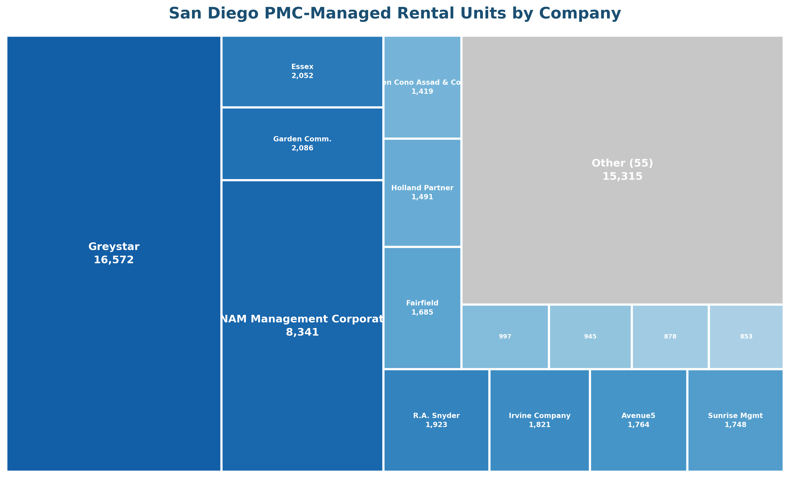
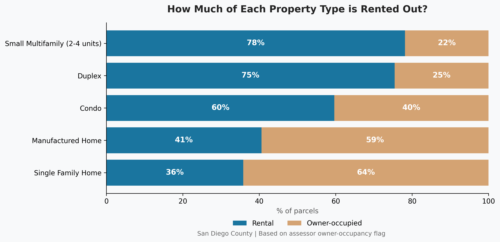
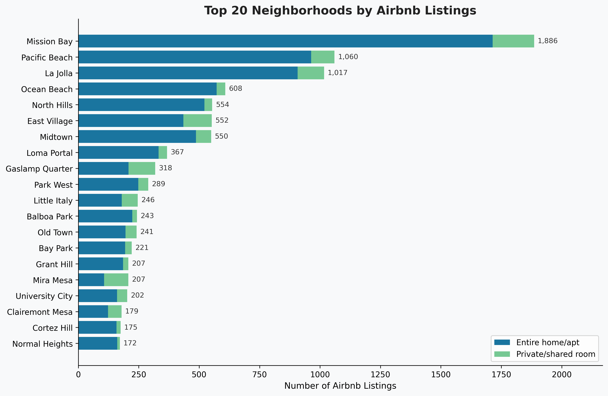

# San Diego Rental Property Data

Open data analysis of San Diego County's rental housing market. Combines
parcel records, property management company data, short-term rental licenses,
crime statistics, building permits, code enforcement, and 311 complaints into
a unified dataset for research and policy analysis.

## Key Findings

**Housing stock:**
- **1,089,584** parcels in San Diego County
- **1,196,234** residential units, of which **712,794** are rental (non-owner-occupied)
- **City of San Diego**: 541,753 residential units, 341,266 rental units
- Only **2.7%** of housing stock was built since 2021 (25K units)
- **60% of condos** are investor-owned rentals (vs 36% of single-family homes)

**Property management:**
- **639 properties** mapped to **74 property management companies** managing **60,000+ units**
- Top 10 PMCs control **66%** of professionally managed units
- The remaining ~250K apartment units have no known PM attribution

**Short-term rentals:**
- **8,325 active STRO licenses** = 2.44% of city rental units
- **13,162 Airbnb listings** (metro-wide, not directly comparable to city-only STROs)
- **6.4% of Airbnb hosts** control **43% of listings**; the largest host operates 169 listings
- 4 coastal neighborhoods (Mission Bay, Pacific Beach, La Jolla, Ocean Beach) account for 35% of all Airbnb activity

**Quality of life (City of San Diego):**
- Illegal dumping is the #1 complaint type (471K reports), still growing
- Encampment complaints grew from 1,140 (2018) to 66,573 (2023), now declining
- 1 in 5 police calls for service are renter-relevant (noise, disturbances, trespassing, theft)

## Visualizations


Share of PMC-managed rental units across San Diego County by property management company.


Share of each property type that is rented out vs owner-occupied. 60% of condos are rentals.


Top 20 neighborhoods by Airbnb listings, split by entire-home vs shared-room rentals.

## Data Sources

| Source | Records | Description |
|--------|---------|-------------|
| [SANDAG Parcels](https://sdgis-sandag.opendata.arcgis.com/) | 1.09M | Parcel boundaries, land use, unit counts, assessed values |
| [City of SD Open Data](https://data.sandiego.gov/) | 3M+ | 311 complaints, code enforcement, STRO/TOT licenses |
| [SD Police NIBRS](https://data.sandiego.gov/) | 500K+ | Crime offenses, calls for service, traffic collisions |
| [Building Permits](https://data.sandiego.gov/) | 400K+ | Permits (set1 + set2), active and closed |
| [Business Tax Certs](https://data.sandiego.gov/) | 300K+ | Active and inactive business registrations |
| [Inside Airbnb](https://insideairbnb.com/san-diego/) | 13K | Airbnb listings with pricing, reviews, availability |
| [CA DRE](https://www.dre.ca.gov/) | 435K | Licensed real estate brokers, salespersons, corporations |
| Apartments.com | 639 | Property management company directory (75 PMCs) |
| Greystar, CONAM | 258 | Direct company website scrapes |

> **Note**: The apartments.com scraper is not included in this repository
> due to the site's terms of service. The scraped data is loaded via the
> enriched CSV.

## Repository Structure

```
sandiego_data/
├── etl/                          # ETL pipeline (Postgres + PostGIS)
│   ├── schema.sql                # 17 tables with spatial indexes
│   ├── etl.py                    # Polars-based loader
│   └── docker-compose.yml        # Postgres + PostGIS container
│
├── sandag/                       # SANDAG parcel data
│   └── rental_properties.ipynb   # County rental inventory analysis
│
├── rental_properties/            # City rental-related data
│   ├── scrape.py                 # Downloads from SD open data portal
│   └── rental_properties.ipynb   # STRO, TOT, business certs, landlord profiles
│
├── apartments_com/               # Property management companies
│   ├── apartments_com.ipynb      # PMC data cleaning & enrichment
│   ├── scrape_greystar.py        # Greystar.com direct scraper
│   └── scrape_pmcs_direct.py     # CONAM, Irvine Company scrapers
│
├── airbnb/                       # Inside Airbnb data
│   └── scrape.py                 # Downloads latest SD scrape
│
├── dre_licensees/                # CA Dept of Real Estate
│   (data downloaded from DRE)
│
├── building_permits/             # Building permits & code enforcement
│   └── scrape.py                 # Downloads from SD open data portal
│
├── police_nibrs_crime/           # Crime data
│   (scraped from SD open data)
│
└── get_it_done/                  # 311 service requests
    (scraped from SD open data)
```

## Database Schema

The ETL loads 17 tables into Postgres with PostGIS for spatial queries:

**City of San Diego open data:**
`service_requests`, `crime_offenses`, `calls_for_service`,
`traffic_collisions`, `building_permits`, `code_enforcement`,
`businesses`, `stro_licenses`, `tot_establishments`,
`city_properties`, `city_leases`, `cfs_call_types`, `complaint_types`

**Supplementary sources:**
`parcels` (SANDAG, with geometry), `pmc_properties` (apartments.com + direct),
`airbnb_listings` (Inside Airbnb, with geometry), `dre_licensees` (CA DRE)

### Example Queries

Crimes within 500m of Greystar properties:
```sql
SELECT p.name, p.street_address, count(*) AS crimes
FROM pmc_properties p
JOIN parcels par ON p.apn = par.apn
JOIN crime_offenses c ON ST_DWithin(par.geom::geography, c.geom::geography, 500)
WHERE p.pmc_name = 'Greystar'
GROUP BY p.name, p.street_address
ORDER BY crimes DESC;
```

STRO density by neighborhood:
```sql
SELECT neighbourhood, count(*) AS stros,
       count(*) FILTER (WHERE room_type = 'Entire home/apt') AS entire_home
FROM airbnb_listings
GROUP BY neighbourhood
ORDER BY stros DESC
LIMIT 20;
```

## Setup

### Prerequisites

- Python 3.12+
- [uv](https://docs.astral.sh/uv/) package manager
- Docker (for Postgres)

### Install dependencies

```bash
uv sync
```

### Download data

```bash
# City of San Diego open data
python building_permits/scrape.py
python rental_properties/scrape.py

# Inside Airbnb
python airbnb/scrape.py

# SANDAG parcels: download Parcels_shapefile.zip from
# https://geo.sandag.org/portal/apps/experiencebuilder/experience/?id=fad9e9c038c84f799b5378e4cc3ed068
# Unzip into sandag/data/, then convert to parquet:
python -c "
from dbfread import DBF
import polars as pl
db = DBF('sandag/data/Parcels.dbf', encoding='latin-1')
pl.DataFrame(iter(db)).write_parquet('sandag/data/parcels.parquet')
"

# CA DRE licensee list
curl -o dre_licensees/data/CurrList.zip https://secure.dre.ca.gov/datafile/CurrList.zip
cd dre_licensees/data && unzip CurrList.zip
```

### Load into Postgres

```bash
cd etl
docker compose up -d
python etl.py
```

### Run notebooks

```bash
# County rental inventory
jupyter lab sandag/rental_properties.ipynb

# PMC analysis
jupyter lab apartments_com/apartments_com.ipynb

# Landlord profiles & STRO analysis
jupyter lab rental_properties/rental_properties.ipynb
```

## Methodology

### Geographic coverage

Parcel data is **county-wide** (all of San Diego County), but crime, police
calls for service, 311 complaints, and code enforcement data only cover the
**City of San Diego**. Properties in other jurisdictions (Chula Vista,
Oceanside, Escondido, El Cajon, Carlsbad, etc.) will show parcel and
property management data but not neighborhood safety or complaint metrics.

### Data sources and caveats

- **Parcel data**: SANDAG county-wide parcel shapefile, updated monthly.
  Unit counts come from the assessor's `UNITQTY` field, which can be stale
  for new construction (may show 0 units for recently built buildings).
  Owner name data is no longer publicly available online since December 2025
  (CA Assembly Bill AB1785)
- **Rental identification**: a parcel is classified as rental when its land
  use code is residential (codes 9-18) and `OWNEROCC != 'Y'`.
  The `OWNEROCC` flag is derived from whether the owner filed a homeowner
  property tax exemption. Some owner-occupants never file, which would
  inflate the rental count. Validation checks against the data:
  - **Census cross-check**: our county-wide rental rate (44.1%) is slightly
    below the Census ACS estimate (~46%), suggesting the overall count is
    in the right range
  - **Zip-level comparison**: we undercount rentals in dense urban zips
    (downtown 92101: ours 64% vs census ~88%) and overcount in suburban
    zips (Carmel Valley 92130: ours 36% vs census ~25%). These biases
    partially cancel at the county level
  - **Assessed value signal**: non-owner-occupied SFRs are assessed 27%
    higher per sqft ($339 vs $266), consistent with investor properties
    that lack the homeowner exemption and get reassessed more on resale
  - **Purchase recency**: 52% of non-owner-occupied SFRs were purchased
    2020-2026 vs 39% of owner-occupied, consistent with higher investor
    turnover
  - **STRO cross-check**: 26.6% of STRO licenses sit on owner-occupied
    parcels, confirming that OWNEROCC='Y' does not preclude rental activity
- **PMC attribution**: sourced from apartments.com PMC directory and direct
  company website scrapes. Represents "listed by" not "verified managed by".
  Covers ~60K of ~310K apartment units (5+ unit buildings) in the county.
  The DRE licensee dataset is loaded for reference but not used for PMC
  validation
- **Building permits**: history spans two city systems (set1 pre-2018,
  set2 2018-present) with different schemas. Pre-2018 records may lack
  dates. Permit holder names reflect the contractor or developer who pulled
  the permit, not necessarily the property owner or manager
- **Code enforcement**: historical dataset covers violations reported before
  January 2018 and closed between 2015 and 2018, with detailed violation
  types. Current code enforcement activity is tracked through Get It Done
  311 reports (2016-present) with less granular categorization. For recent
  case-level data, see [OpenDSD](https://opendsd.sandiego.gov/web/cecases/)
- **Crime data**: NIBRS offenses from San Diego Police Department, 2020-2026.
  City of San Diego jurisdiction only, not county-wide
- **Police calls for service**: dispatch records including noise complaints,
  trespassing, disturbances, and other incidents that may not result in a
  formal crime report. Covers the same City of San Diego jurisdiction as
  NIBRS data. Included in the database and available for address-level
  queries
- **311 complaints**: Get It Done service requests, 2016-present.
  City of San Diego only. Includes encampments, graffiti, parking, noise,
  illegal dumping, infrastructure maintenance, and other categories
- **Airbnb data**: single-point-in-time scrape from Inside Airbnb
  (September 2025). Covers the San Diego metro area (not just the city),
  Airbnb listings only (not VRBO or other platforms). Listings churn
  significantly; properties active in September 2025 may be inactive now
  and vice versa. The 13K Airbnb listing count is not directly comparable
  to the 8.3K city-only STRO license count due to this geographic mismatch

### Address matching

Three-pass approach used for STRO, PMC, and TOT cross-references:

1. Street number + street name + zip (exact)
2. Street number + street name + city (no zip, with jurisdiction filter)
3. Nearest address number on the same street + zip (within 50)

Normalizes suffixes (STREET/ST/AVENUE/AVE), directions (NORTH/N/SOUTH/S),
ordinals (FOURTH/4TH), abbreviations (MT/MOUNT), periods, unit numbers,
and address ranges. STRO licenses matched to parcels at 98.1% using this
approach.

### Confidence flagging

Properties are assigned a confidence level:
- **high**: exact or no-zip match with plausible unit count
- **pass3**: proximity match (nearest address within 50 house numbers)
- **low**: PMC with 5+ properties showing 0-4 units (likely wrong parcel
  match from new construction; unit counts nulled out)
